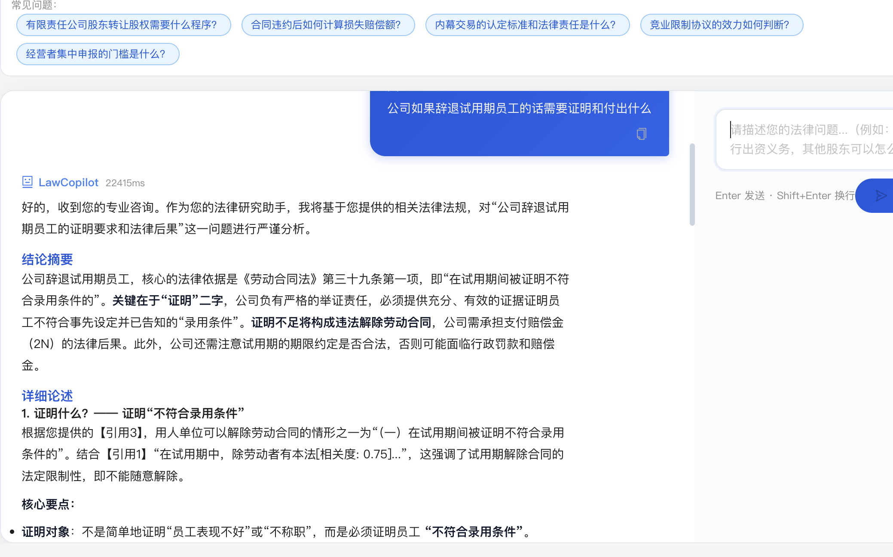
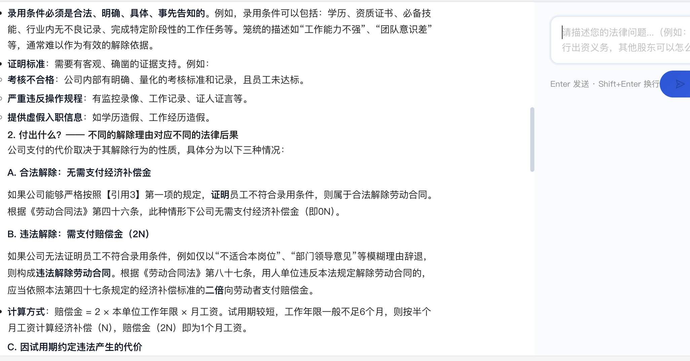
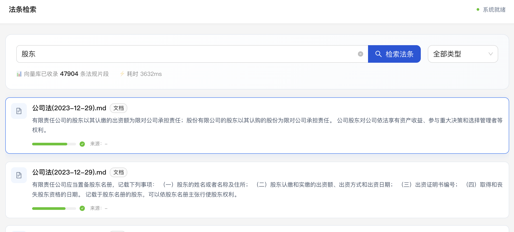

# LawCopilot - 法律研究助手

面向执业律师的法律研究 RAG + LLM 系统，支持法条检索、案例分析、法律文书生成。





## 快速开始

### 环境要求

- Python 3.11+
- Node.js 18+
- Docker（用于 Qdrant 向量数据库）
- DeepSeek API Key（[申请地址](https://platform.deepseek.com/)）

### 1. 克隆项目

```bash
git clone <your-repo> law-copilot
cd law-copilot
```

### 2. 启动 Qdrant 向量数据库

```bash
docker run -d \
  --name law-qdrant \
  -p 6333:6333 \
  -p 6334:6334 \
  -v ~/docker/qdrant:/qdrant/storage \
  qdrant/qdrant:v1.12.0
```

### 3. 配置后端

```bash
cd backend
cp .env.example .env
# 编辑 .env，填入 LLM_API_KEY
```

`.env` 关键配置说明：

| 变量 | 说明 | 默认值 |
|------|------|--------|
| `LLM_API_KEY` | DeepSeek API 密钥 | 必填 |
| `LLM_MODEL` | LLM 模型 | `deepseek-chat` |
| `LLM_BASE_URL` | API 地址 | `https://api.deepseek.com/v1` |
| `EMBEDDING_PROVIDER` | 向量化方案（local/auto） | `local` |
| `EMBEDDING_MODEL` | 本地向量模型（FastEmbed 白名单） | `BAAI/bge-small-zh-v1.5` |
| `EMBEDDING_DIMENSIONS` | 向量维度 | `512` |

### 4. 安装后端依赖并启动

```bash
cd backend

# 创建虚拟环境（推荐 uv）
uv venv
source .venv/bin/activate

uv pip install -r requirements.txt

# 启动后端服务
uv run uvicorn app.main:app --host 0.0.0.0 --port 8000
```

### 5. 安装前端依赖并启动

```bash
cd frontend

pnpm install
pnpm run dev
```

### 6. 访问

- 前端：**http://localhost:3000**
- 后端 API：**http://localhost:8000**
- Qdrant Dashboard：**http://localhost:6333/dashboard**
- API 文档：**http://localhost:8000/docs**（Swagger UI）

## 法律数据入库

### 方式一：FLK 国家法律法规数据库爬取（推荐）

```bash
cd backend
source .venv/bin/activate

# 索引模式：扫描文档列表 + 元数据
uv run python scripts/flk_scraper.py

# 全文模式：下载并提取法律条文全文
uv run python scripts/flk_scraper.py --fulltext
```

爬虫自动按 FLK 分类存储到 `data/laws_flk/`，每个分类独立目录 + `_index.json` 索引。

### 方式二：从旧数据进行向量迁移

```bash
cd backend
source .venv/bin/activate

# 从旧 Qdrant 集合迁移到新集合（含 re-embedding）
uv run python scripts/migrate_vectors.py
```

迁移使用本地 FastEmbed（bge-small-zh-v1.5, 512维）重新向量化，无需 API 调用。

### 方式三：用户文档上传

前端「文档管理」页面支持上传 PDF/Word/Markdown/TXT 文件，自动清洗、分块、向量化入库。

## 项目结构

```
law-copilot/
├── backend/
│   ├── app/
│   │   ├── main.py              # FastAPI 入口
│   │   ├── config.py            # 全局配置
│   │   ├── models/
│   │   │   ├── schemas.py       # Pydantic 基础数据模型
│   │   │   └── enhanced.py      # 增强数据模型（AtomicLegalKnowledge 等）
│   │   ├── routers/
│   │   │   ├── chat.py          # 对话接口
│   │   │   ├── search.py        # 检索接口
│   │   │   └── document.py      # 文档管理接口
│   │   └── services/
│   │       ├── rag_service.py         # RAG 核心服务（三领域Prompt+双路检索）
│   │       ├── embedding_service.py   # 向量化服务（FastEmbed/MPS）
│   │       ├── collection_manager.py  # Qdrant 多集合管理器
│   │       ├── query_rewriter.py      # 法律查询重写（提取法名+条文号）
│   │       ├── retriever_service.py   # 三路检索器（BM25+语义+字段）
│   │       ├── reranker_service.py    # BGE-Reranker 重排序服务
│   │       └── knowledge_extractor.py # 原子知识提取（LLM）
│   ├── scripts/
│   │   ├── flk_scraper.py            # FLK 国家法律法规库爬虫
│   │   ├── migrate_vectors.py        # Qdrant 存量向量迁移
│   │   ├── extract_knowledge.py      # 全量原子知识提取
│   │   ├── update_knowledge.py       # 增量知识更新
│   │   └── test_search.py            # 检索效果测试
│   ├── data/
│   │   └── laws_flk/                 # FLK 爬取数据（按分类目录）
│   ├── requirements.txt
│   └── .env.example
├── frontend/
│   ├── src/
│   │   ├── App.jsx
│   │   ├── main.jsx
│   │   ├── pages/
│   │   │   ├── ChatPage.jsx    # 法律问答
│   │   │   ├── SearchPage.jsx  # 法条检索
│   │   │   └── DocumentPage.jsx # 文档管理
│   │   └── services/api.js
│   ├── package.json
│   └── pnpm-lock.yaml
└── README.md
```

## RAG 核心流程

```
用户提问
  │
  ▼
① 领域检测（detect_domain）
   ├─ 刑事 → CRIMINAL_PROMPT
   ├─ 经济 → ECONOMIC_PROMPT
   └─ 通用 → GENERAL_PROMPT
  │
  ▼
② 查询重写（QueryRewriter）
   提取 law_name + article_number
  │
  ▼
③ 双路检索
   ├─ 精确字段匹配 → ⭐ 高优先级（精确命中法条+条文号）
   └─ 语义向量检索 → FastEmbed + Qdrant COSINE 搜索
  │
  ▼
④ 去重融合 + 重排序
  │
  ▼
⑤ LLM 生成（DeepSeek + 领域 Prompt）
```

## 技术栈

| 层级 | 技术 |
|------|------|
| 前端 | React 18 + Ant Design 5 + Vite 6 |
| 后端 | Python 3.11 + FastAPI |
| 向量数据库 | Qdrant v1.12 |
| Embedding | **FastEmbed ONNX** (bge-small-zh-v1.5, 512维) |
| LLM | DeepSeek `deepseek-chat` |
| 重排序 | Jina Reranker API |
| 文档处理 | LangChain + Unstructured |

### Embedding 方案选择

| 方案 | 维度 | 速度 | 依赖 | 推荐场景 |
|------|------|------|------|----------|
| ✅ FastEmbed (ONNX) | 512 | ~3000条/s | fastembed | **默认推荐，稳定高效** |
| SentenceTransformer | 1024 | ~200条/s | torch+transformers | 需要更大模型时备用 |
| Jina AI API | 1024 | 取决于网络 | requests+API Key | 云端/无需本地模型时 |

## 环境变量参考

```bash
# DeepSeek LLM
LLM_API_KEY=***
LLM_MODEL=deepseek-chat
LLM_BASE_URL=https://api.deepseek.com/v1
LLM_TEMPERATURE=0.1

# Embedding（本地模型，无需 API Key）
EMBEDDING_PROVIDER=local
EMBEDDING_MODEL=BAAI/bge-small-zh-v1.5
EMBEDDING_DIMENSIONS=512

# Qdrant
QDRANT_HOST=localhost
QDRANT_PORT=6333
QDRANT_COLLECTION=laws

# RAG 参数
TOP_K=5
SCORE_THRESHOLD=0.3
```

## License

MIT
